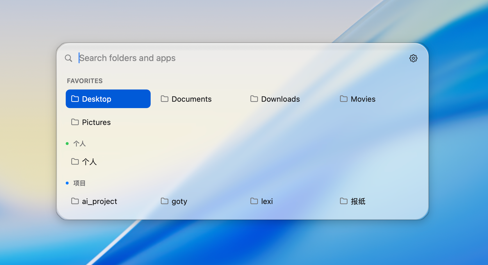
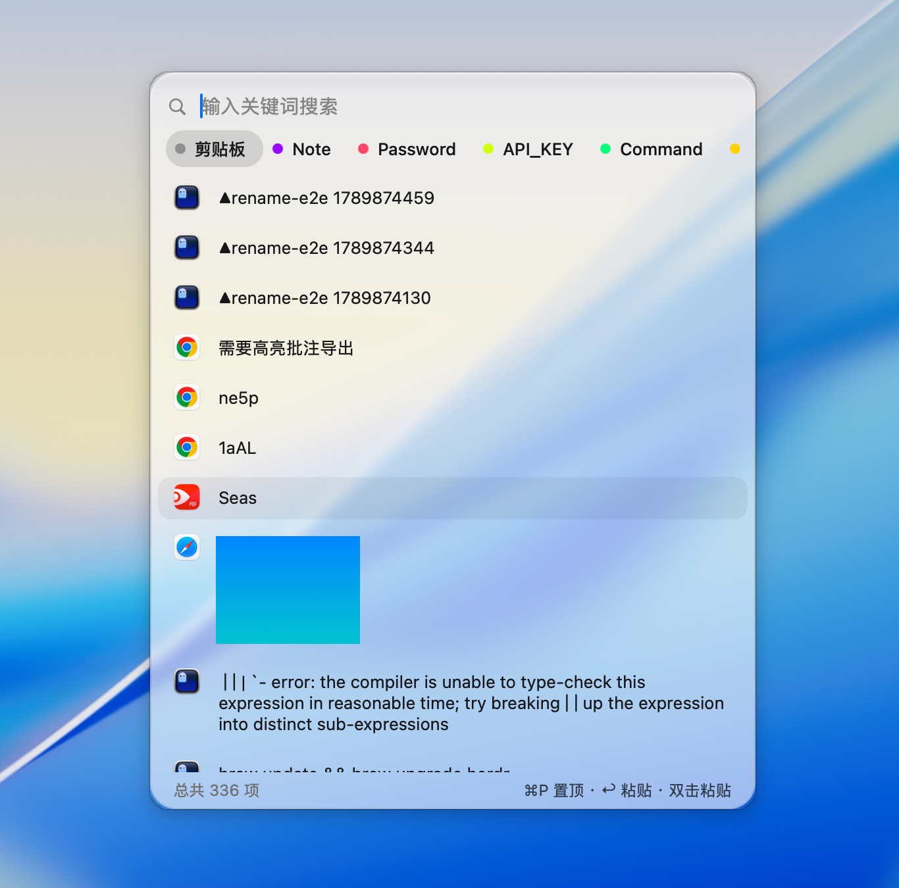
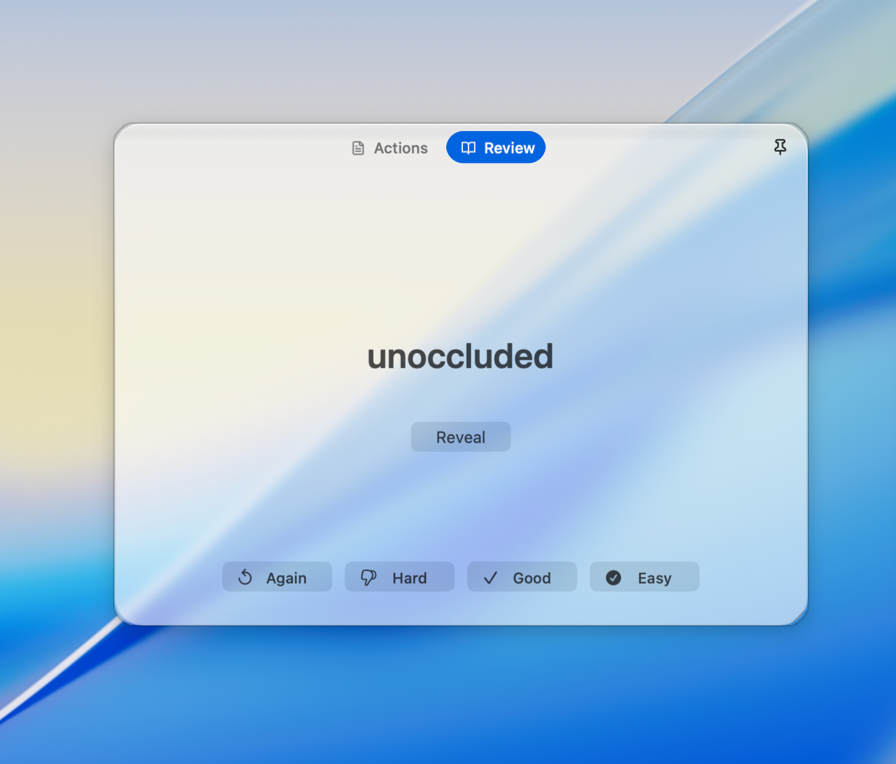
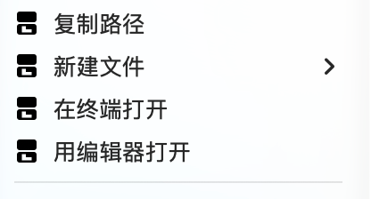
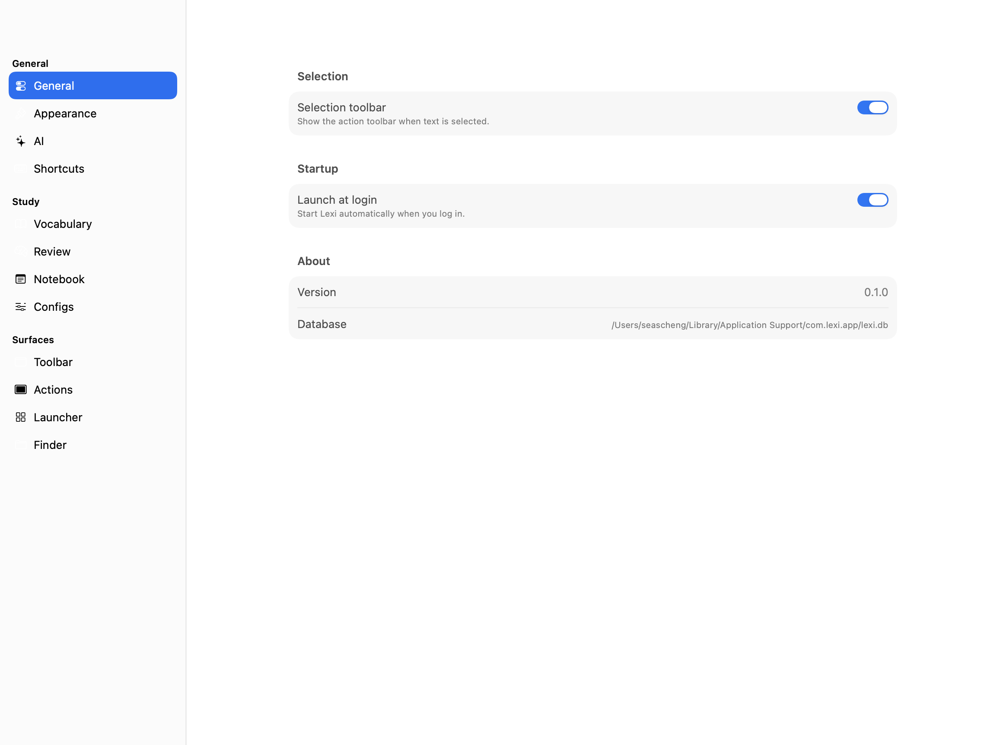
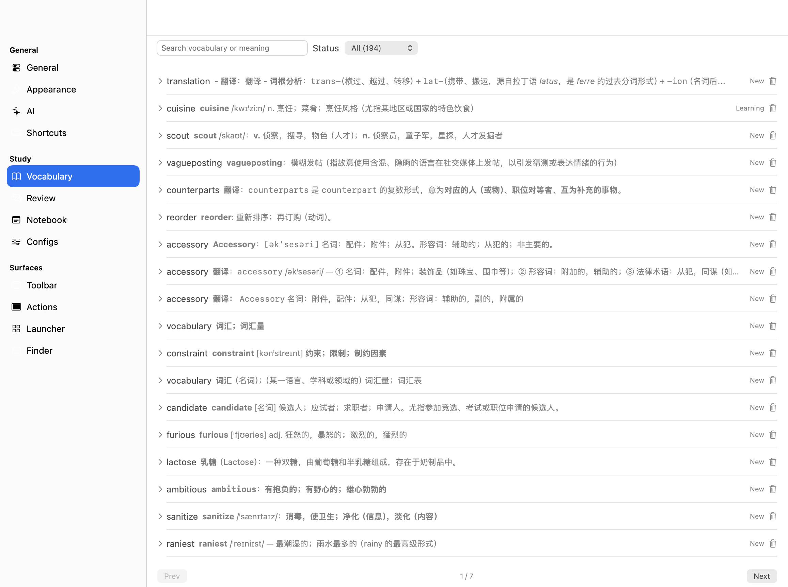
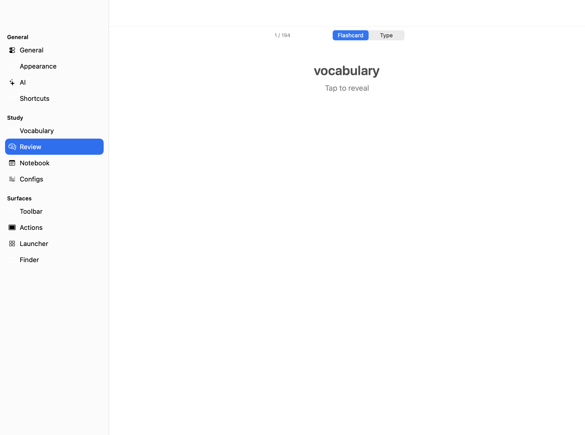

<div align="center">


### Lexi

**A native macOS enhancement suite: act on any selection, own your clipboard, launch everything — with language learning built in.**

<sub>Swift · AppKit · SQLite — no webview, no Electron, no Node toolchain</sub>
<sub>v0.1.0 · macOS 13+ · ad-hoc signed</sub>

<br />
<sub>Double-Shift (recordable — even <code>⌘Space</code>): the folder grid. Favorites, your Finder tag groups in their real tag colors, recents.</sub>

</div>

## Install

Build from source (Xcode command-line tools):

```sh
cd Lexi
./build.sh            # swiftc -O over the sources -> codesigned LexiSelectionHelper.app
./build.sh run        # build, kill the running instance, relaunch
```

Drag `LexiSelectionHelper.app` wherever you keep it and launch. Ad-hoc signed: on first open, right-click the app → **Open** (once).

On first launch, grant **Accessibility** and **Screen Recording** when prompted — the selection reading chain and the global shortcuts need them, and both grants are tied to the bundle id (`com.lexi.selection-helper`), so don't change it casually. Launch at login via **Settings → General → Startup** (SMAppService).

## Who it's for

### You act on text all day

Docs, issues, papers, error messages, chats, logs. Whatever the text is, Lexi keeps the next action one selection away — no app switching, no copy-paste detour.

- **Selection toolbar over any text** — select anywhere and a small pill appears above it: translate, rewrite, speak, extract, or your own configured actions. The reading chain (AX direct read → range slice → WebArea) never swallows your mouse or keyboard events, and triggers on drags, double-clicks, ⌘A, and shift-extend alike.
- **A streaming AI card, not a popup webpage** — results render as native markdown as they stream; each run gets its own tab, cards can be pinned, and the input line lets you follow up in place.
- **From text to knowledge in one click** — save the word to your vocabulary or file the sentence as a note, straight from the card.


### You live on the keyboard and the clipboard

- **Launcher, two keystrokes away** — double-Shift by default, and the shortcut is fully recordable (`⌘Space` works — fired combos are consumed so Spotlight doesn't double-open). Empty query shows the folder grid; typing switches to unified results: folders, apps, recent usage — led by a calculator row when the query parses as math (Enter copies).
- **Clipboard history that stays out of the way** — `⌥V` opens the panel; paste-through promotes the item (the pasted entry becomes the clipboard, standard clipboard-manager semantics). Full-text search, pinning, file links, and a notes tab with categories.
- **Finder right where you right-click** — a Lexi submenu in Finder: copy path, new file, open in terminal, open in editor. Each action toggles independently in Settings → Finder.

<div align="center">

<br />
<sub>Clipboard history: categorized chips (剪贴板 / Note / Password / API_KEY / Command), keyword search, per-entry context menu, ⌘P pin · ⏎ paste.</sub>
</div>

### You learn languages along the way

English study lives inside the same surfaces — not a separate study app.

- **SM-2 spaced repetition, built in** — the card's Review tab is a flashcard flow: reveal, then grade Again / Hard / Good / Easy. Due scheduling follows the classic SM-2 algorithm.
- **A vocabulary that reflects usage** — words saved from cards land in the Vocabulary pane with source sentence and status; the list is searchable and paginated.
- **Notes with exactly one category** — the notebook keeps every saved sentence filed under a category you manage; the same categories drive the clipboard panel's notes tab and the card's notes tab.
- **Your AI features, your prompts** — the Configs pane edits every built-in feature (prompt template, output mode, target language, icon, auto-save) and adds new ones; the toolbar and card pick them up live.

<div align="center">


<br />
<sub>Left: the Review flashcard. Right: the Finder right-click menu.</sub>
</div>


<div align="center">



<br />
<sub>Settings: General, Vocabulary, Review — twelve panes in one native window.</sub>
</div>

## What's inside

| | |
|---|---|
| **Selection toolbar** | pill over any selection · AX read chain (direct → range slice → WebArea) · never swallows events · drag handle · actions configured in Settings |
| **Result card** | per-run tabs · streaming markdown · follow-up input · pin · notes / review tabs · TTS speak |
| **Clipboard panel** | 0.5s poller → SQLite history · paste-through promotes · FTS search · pin · file links · notes tab |
| **Launcher** | double-Shift (recordable, `⌘Space` OK) · folder grid: favorites + Finder tag groups in real tag colors (xattr `_kMDItemUserTags`) + recents · unified results: folders + apps + recent usage · calculator row (Enter copies) |
| **Vocabulary & Review** | save-to-vocab from the card · SM-2 scheduling · Again/Hard/Good/Easy grading · status list |
| **Notebook** | notes with exactly one category each · categories manage themselves into every surface |
| **Finder menu** | FinderSync appex: 复制路径 · 新建文件 · 在终端打开 · 用编辑器打开 · per-action toggles |
| **Settings** | native split-view window: General / Appearance / AI / Shortcuts / Vocabulary / Review / Notebook / Configs + per-surface panes (Toolbar, Card, Clipboard, Launcher, Finder) · applies in-process, persists to SQLite |
| **AI** | OpenAI-compatible SSE streaming · built-in features + your own (prompt, output mode, target language) · system TTS |
| **Shortcuts** | global, recordable — key combos (incl. `⌘Space`, arrows, Space, Return…) and double-modifier taps · fired combos are consumed |
| **Data** | `~/Library/Application Support/com.lexi.app/lexi.db` (settings, words, notes, features) + `com.lexi.selection-helper/clipboard.sqlite3` · nothing leaves the Mac except the AI endpoint you configure |

## Build & debug

```sh
cd Lexi
./build.sh          # compile + codesign LexiSelectionHelper.app
./build.sh run      # build, kill the running instance, launch
```

- Helper log: `/private/tmp/lexi-selection-helper.log`
- Headless UI snapshots: launch with `--debug-server`, then `POST /debug-shot?tab=<pane>`, `/debug-launcher-shot[?query=]`, `/debug-clip-shot`, `/debug-card-shot`, `/debug-toolbar-shot` on `127.0.0.1:43877` — every screenshot in this README was captured through these routes.

## Architecture

```
Lexi/
  App/        app delegate: lifecycle, shared state, action routing
  Data/       LexiStore (SQLite) · ClipboardStore · FinderSyncConfig
  Debug/      headless debug server (the /debug-* routes)
  Design/     theme tokens · lucide icon set · logo
  Services/   AI SSE service · selection pipeline · shortcut monitor · clipboard monitor
  UI/         Toolbar / Result card / Clipboard / Launcher / Settings panes
  FinderSync/ Finder right-click extension (.appex, zero IPC with the main app)
```

One native Swift app — the entire product is AppKit; the only compiled extras are the FinderSync extension and the two SQLite stores. Long-lived invariants live in `AGENTS.md` and are binding.

---

<div align="center">
<sub>

Icons from [Lucide](https://lucide.dev) · spaced repetition by SM-2 · v0.1.0

</sub>
</div>
